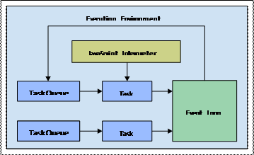
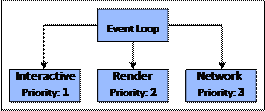
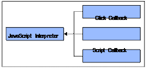
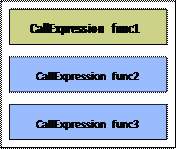
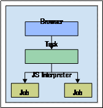
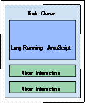

## 第二章 JavaScript运行模型

这本书的第一章我们探讨了JavaScript并发性的一些情况。一般来说，对于并发处理的JavaScript应用程序是什么

只是一个小事。有很多想编写并发JavaScript代码的，提出的一些解决办法并不是非常规范的。有很多回调，

并且用到的所有这些回调就足够让一个人发疯了。我们还看了下我们编写的并发JavaScript代码如何开始

对现有的组件方式产生改变。Web workers已经开始趋向成熟，然而JavaScript语言并发结构也慢慢出现。


JavaScript语言和运行时环境已经是定下来的。我们需要在设计层面考虑并发性，而不是在编写代码时。并发应该

是默认的。这说起来很容易，但很难做到。在本书中，我们将探讨JavaScript并发所提供的所有功能，以及我们

如何利用好它们作为设计工具的优势。但是，我们在这样做之前，需要深入了解JavaScript运行时究竟是怎样的。

这些是设计并发应用程序的必要知识，因为我们需要确切地知道在选择一种并发机制时会发生什么。


在本章中，我们将从浏览器环境开始，查看代码运行所涉及的所有子系统 - 例如JavaScript解释器，任务队列和DOM本身。

然后我们将介绍一些代码示例，这些代码将揭示运行我们的代码时真正发生的事情。最后我们将通过讨论在这个

模型中面临的挑战来结束本章。


### 一切都是任务

当我们访问网页时，会在浏览器中为我们创建整个环境。根据万维网联盟（W3C）规范，这个环境有几个子系统，使我们正在浏览的

网页外观和行为都不错。任务是Web浏览器中的一个基本抽象。任何发生的事情要么是一个任务本身，要么是较大任务的一部分。


> 如果您正在阅读任何W3C规范，他们使用术语“用户代理”而不是“Web浏览器”。在99.9％的情况下，我们正在阅读的内容符合
> 主要的浏览器提供商。


在本节中，我们将介绍这些环境的主要组件，以及任务队列和事件循环如何在这些组件之间进行通信，以实现网页的整体外观和交互行为。


#### 大体的介绍

这里先介绍这些术语，它们将在本章的各个部分进行讲解：

• **执行环境**：每当打开新网页时，都会创建此容器。这是一个丰富复杂的环境，它拥有我们的JavaScript代码将与之交互的一切。

它也可以作为沙箱 - 我们的JavaScript代码无法访问环境之外的东西。

• **JavaScript解释器**：这是负责解析和执行JavaScript源代码的组件。浏览器的工作是使用全局变量来扩充解释器，例如

window和XMLHttpRequest。

• **任务队列**：只要发生一些事情，就会有任务排队。一个执行环境至少有一个这样的队列，但通常它有几个队列。

• **事件循环**：执行环境具有单一的事件循环，负责为所有任务队列提供服务。只有一个事件循环，因为只有一个线程。


Web浏览器中创建的执行环境如下图。任务队列是浏览器中发生的任何事情的入口。例如，一个任务可以用于通过将脚本传递给

JavaScript解释器来执行脚本，而另一个任务用于渲染DOM更新。现在我们将深入研究这个环境的组成部分。


 

#### 执行环境

也许Web浏览器执行环境中最具启发性的方面是我们的JavaScript代码相对于执行它的解释器所占的部分要小。我们的代码

可以看作只是大机器中的一个齿轮。在这些环境中肯定会发生很多事情，因为浏览器实现的平台有大量的用途。这不仅仅是

在屏幕上渲染元素，而是使用样式属性增强这些元素。DOM本身类似于微平台，就像网络设施，文件访问，安全性等一样。

所有这些部分对于网站运行的网络环境以及相关的应用程序至关重要。


在并发环境中，我们最感兴趣的是将所有这些部分组合在一起运行的机制。我们的应用程序主要用JavaScript编写，

解释器知道如何解析和运行它。但是，这最终如何转化为页面上的视觉变化？浏览器的网络组件如何知道发出HTTP请求，

以及响应完成后如何调用JavaScript解释器？


这些不同部件之间的协调限制了我们在JavaScript中的并发使用。这些限制是必要的，因为没有它们，

开发Web应用程序将变得相当复杂。


#### 事件循环

一旦执行环境准备好了，事件循环就是首先要启动运行的部件之一。它的工作是为环境中的一个或多个任务队列提供服务。

浏览器提供商可以根据需要自由实现队列，但必须至少有一个队列。如果他们愿意的话，浏览器可以将每个任务放在一个队列中，

以同等的优先级运行每项任务。这样做的问题意味着如果队列被积压，那么有些必须获得优先级的任务（例如鼠标或键盘事件）

就会出现问题了。


在实践中，如果没有其他原因不按优先级分离任务，那么拥有少数队列是有意义的。这一点很重要，因为只有一个

控制线程 - 意味着只有一个CPU - 来处理这些队列。以下是通过不同级别的优先级为几个队列提供服务的事件循环：




即使事件循环与执行环境一起启动，这并不意味着它总是要处理它的任务。如果总是要处理任务，那么实际应用程序

永远不会有任何CPU空闲时间。事件循环将等待更多任务，优先级高的队列首先得到服务。例如，使用前面这张图中

应用的队列，将始终首先为交互队列提供服务。即使事件循环正在处理渲染队列任务，如果交互式任务排队，事件循环

将在处理渲染任务恢复之前处理此任务。


#### 任务队列

任务队列的概念对于理解Web浏览器的工作方式至关重要。浏览器这个术语实际上是有误导性的。我们使用它们在早期

的一些网站中浏览静态网页。现在，大型复杂的应用程序在浏览器中运行 - 它实际上更像是一个Web平台。为它们提供

服务的任务队列和事件循环可能是处理这么多部件的最佳设计。


我们在本章前面看到，从执行环境的角度来看，JavaScript解释器以及它解析和运行的代码实际上只是一个黑盒子。

事实上，调用解释器本身就是一项任务，而且反映了JavaScript的即时运行的特性。许多任务涉及JavaScript

解释器的调用，如下所示：




这些事件中的任何一个 - 用户单击元素，页面中加载的脚本或来自先前API调用的数据返回浏览器 - 创建调用

JavaScript解释器的任务。它告诉解释器运行一段特定的代码，并且它将继续运行直到完成。这是JavaScript

的即时运行的特性。接下来，我们将深入研究这些任务创建的执行上下文。


### 执行上下文

现在是时候看看JavaScript解释器本身 - 这是当事件发生并且代码需要运行时从其他浏览器组件接管的组件。

在解释器中，我们会找到一堆上下文，但总有一个活跃的JavaScript上下文。这与堆栈控制活动上下文的许多

编程语言类似。


将活动上下文视为我们JavaScript代码中正在发生的事件的快照。使用堆栈结构是因为活动上下文可以被随时

更改为其他内容，例如调用函数时。发生这种情况时，会将新快照推送到堆栈，成为活动上下文。当它完成运行时，

它会从堆栈中弹出，将下一个上下文保留为活动上下文。


在本节中，我们将了解JavaScript解释器如何处理上下文切换，以及管理上下文堆栈的内部任务队列。


#### 维护执行状态

JavaScript解释器中的上下文堆栈不是静态结构 - 它在不断变化。在这个堆栈的整个生命周期中发生了两件

重要的事情。首先，在堆栈的顶部，我们有活动的上下文。这是解释器在其指令中移动时当前执行的代码。

这里有张示图说明JavaScript执行上下文堆栈的概念，活动上下文始终位于顶部：




调用堆栈的另一个重要事情是当活动上下文停用时为其记录状态。例如，假设在几条语句之后，func1()调用

func2()。此时，在调用func2()之后，直接将上下文添加到该位置。然后，它被替换为新的活动上下文 - func2()。

完成后，重复该过程，func1()再次成为活动上下文。


这种上下文切换发生在我们的整个代码执行过程中。例如，有一个全局上下文，它是我们代码的入口，函数本身具有

自己的上下文。最近JavaScript还有一些新增的语言特性，它们也有自己的上下文，如模块和生成器。

接下来，我们将看看负责创建新执行上下文的任务队列。


#### 工作队列

工作队列类似于我们之前查看的任务队列。不同之处在于工作队列特定于JavaScript解释器。也就是说，

它们被封装在解释器中 - 浏览器不直接与这些队列交互。但是，当浏览器调用解释器时，例如，响应于加载的脚本

或事件回调任务时，解释器将创建新的工作。




JavaScript解释器中的工作队列实际上比用于协调所有Web浏览器组件的任务队列简单得多。只有两个必要的队列。

一个用于创建新的执行上下文堆栈（调用堆栈）。另一个特定于promise解析回调函数。


> 我们将在下一章深入探讨promise解析回调工作的原理。


鉴于这些内部JavaScript工作队列的职责限制，有些人可能得出结论：它们是不必要的 - 过度设计的行为。

事实并非如此，因为虽然今天在这些工作中发现的它们职责有限，但是工作队列设计让语言更容易地扩展和改进。

特别是，在考虑未来语言版本中的新并发结构时，工作队列机制是很有意义的。


### 使用计时器创建任务

到目前为止，在本章中，我们已经了解了Web浏览器环境的所有内部组件，以及JavaScript解释器在此环境中的应用位置。

所有这些与将并发原则应用于我们的代码有什么关系？通过了解底层发生的事情，我们可以更深入地弄明白运行代码块时

发生的情况。特别是，我们知道相对于其他代码块发生了什么; 时间排序是一个至关重要的并发属性。


这就是说，让我们实际写一些代码。在本节中，我们将使用定时器将任务显式添加到任务队列。我们还将了解JavaScript

解释器何时何地跳转并开始执行我们的代码。


###3 使用setTimeout()

所述的setTimeout()函数是在任何JavaScript代码定住。它用于在将来的某个时刻执行代码。新的JavaScript

程序员经常被setTimeout()函数弄迷糊，因为它是一个计时器。在未来的某个时间点设定，比如说3秒后，将调用回调

函数。当我们调用setTimeout()时，我们将获得atimer ID作为值，稍后可以使用clearTimeout()清除它。

以下是setTimeout()的基本用法：

```javascript
//创建一个可以调用我们函数的计时器比如300MS。
//我们可以使用console.time()和console.timeEnd()函数看到它实际需要多长时间
//
//这通常是301MS左右，根本不是用户可以注意到的，
//但调度函数调用得到的准确性并不可靠
var timer = setTimeout(() => {
	console.timeEnd('setTimeout');
}，300);

console.time('setTimeout');
```

这是JavaScript新手常常误解的部分;这个计时器只能尽量保证时间准确性的。我们使用setTimeout()时唯一的保证

是我们的回调函数永远不会比我们传递它的时间更快地被调用。因此，如果我们说在300毫秒内调用此函数，它将永远

不会在275毫秒内调用它。一旦300毫秒过去，新任务就会排队。如果在此任务之前没有任何排队等待，则回调会按时运行。

即使有一些事情在它前面的队列，也不容易被察觉 - 它似乎在正确的时间运行。


但正如我们所见，JavaScript是单线程运行的。这意味着一旦JavaScript解释器启动，它就不会停止直到它完成; 

即使有任务等待定时器事件回调。因此，即使我们要求定时器在300毫秒内执行回调，它完全有可能会在500毫秒时

执行。我们来看一个例子来看看它是如何可能的：

```javascript
//注意，这个函数会占用CPU ...
function expensive(n = 25000) {
	var i = 0;
	while(++ i <n * n) {}
	return i;
}


//创建一个计时器，回调使用console.timeEnd()看看我们等了多久
//是否是真的等了我们期待的300MS
var timer = setTimeout(() => {
	console.timeEnd('setTimeout');
}, 300);

console.time('setTimeout');

//这需要几秒钟的时间在CPU上完成。
//同时任务已排队等待运行我们的回调函数
//但事件循环无法获得到那个任务队列，直到expensive()完成。
expensive();
```

#### 使用setInterval()

setInterval()函数是setTimeou()函数的姐妹。正如其名，它接受一个回调函数，以固定的时间间隔进行调用执行。

在事实上，setInterval()函数采用了和setTimeout()完全相同的参数。唯一的区别是在于它会不断的调用执行

回调函数的功能，每隔X毫秒，直到该计时器被使用clearInterval()函数清除。


当我们想要一遍又一遍地调用相同的函数时，这个函数很实用。例如，如果我们轮询API接口，则setInterval()

是一个很好的候选解决方案。但是，请记住，回调函数的调用是固定的。也就是说，一旦我们用1000毫秒调用

setInterval()，没有清除定时器就没有改变1000毫秒。对于间隔需要是动态的场景，使用setTimeout()可以更好

地实现。回调函数中设定下一个间隔，允许间隔是动态的。例如，通过增加间隔时间来不断地轮询API。


在我们上次查看的setTimeout()示例中，我们看到了运行JavaScript代码如何破环事件循环。也就是说，它阻止

事件循环使用我们的回调函数来调用JavaScript解释器的任务。这允许我们将代码执行推迟到将来的某个点，但没有准确的

保证。让我们看看当我们使用setInterval()计划任务时会发生什么。还有一些后续运行的JavaScript代码块：

```javascript
//一个跟踪我们正在进行第几次执行的计数器。
var cnt = 0;

//设置interval计时器。回调会记录调度回调函数的次数。
var timer = setInterval(() => {
	console.log('Interval'，++cnt);
}, 3000);

//阻塞CPU一段时间。当我们不再阻塞CPU时，调用第一个interval，
//如预期的那样。然后第二个，如果预料到的话。依次类推
//因此，当我们阻止回调任务时，我们就是阻止执行下一个间隔的任务。
expensive(50000);
```

### 响应DOM事件

在上一节中，我们了解了如何延时运行JavaScript代码。这是由其他JavaScript代码明确完成的。大多数情况下，

我们的代码会响应用户交互而直接运行。在本节中，我们将介绍一些公共接口，不仅由DOM事件使用的，还包括网络和

Web组件事件等。我们还将研究一种处理大量类似事件的技术 - 称为去抖。


#### 事件对象

事件对象接口被许多浏览器组件所使用，包括DOM元素。这是我们如何分发事件到元素以及监听到的事件和执行一个回调函数

作为响应。它实际上是一个非常简单的交互，很容易被捕捉到。这是至关重要的，因为许多不同类型的组件使用相同的接口

进行事件管理。我们将会通过这本书看到进展。


上一节中使用的计时器的回调函数与执行EventTarget事件是相同的任务队列机制。如果事件被触发，一个使用对应的回调函数

调用JavaScript解释器的任务将被加入任务队列。在这里使用setTimeout()所面临的限制同样会出现。下面是当长时间

运行的JavaScript代码阻塞用户事件时的任务队列的示图：




除了将侦听器函数附加到对用户交互做出反应的事件目标上之外，我们还可以手动触发这些事件，如下代码所示：

```javascript
//通用事件回调，记录事件时间戳
function onClick(e) {
	console.log('click'，new Date(e.timeStamp));
}

//我们将要用作事件的元素目标对象。
var button = document.querySelector('button');

//设置我们的 onClick 功能作为此目标上 click 事件的事件侦听器。
button.addEventListener('click'，onClick);

//除了用户点击按钮外，还有EventTarget接口让我们手动调度事件
button.dispatchEvent(new Event('click'));
```

最好是尽可能命名一下回调中使用的函数。这样，当我们的代码出错时，跟踪查找问题就容易得多。使用匿名函数

并不是不可以，它只是在追踪问题时会耗费更多时间。另一方面，箭头功能更简洁，具有更大的绑定灵活性。

选择使用它是明智的。


#### 控制事件频率

用户交互事件的一个挑战是在很短的时间内可能有很多这样的事件。例如，当用户在屏幕上移动鼠标时，会触发数

百个事件。如果我们有监听这些事件，任务队列将很快被填满，用户体验也就将会很糟糕。


即使我们确实创建有高频事件（例如鼠标移动）的事件监听器，我们也没必要响应所有这些事件。例如，如果在

1-2秒内发生了150次鼠标移动事件，我们只关心最后一次移动 - 鼠标指针的最近位置。也就是说，使用我们的事件

回调代码调用JavaScript解释器的次数比需要的多149倍。


为了处理这种高频事件场景，我们可以使用一种称为去抖的技术。去抖函数意味着如果在给定时间范围内连续多次

调用它，则实际仅使用最后一个调用，并忽略所有先前的调用。让我们来看下面例子是如何实现的：

```javascript
//跟踪“mousemove”事件的数量
var events = 0;

//debounce()将提供的 func 来限制调用它的频率
function debounce(func, limit) {
	var timer;
	return function debounced(...args) {
		//移除所有现有的计时器
		clearTimeout(timer);

		//在“limit”毫秒后调用函数
		timer = setTimeout(() => {
			timer = null;
			func.apply(this, args);
		}, limit);
	};
}

//记录有关鼠标事件的一些信息, 并记录事件总数。
function onMouseMove(e) {
	console.log(`X ${e.clientX} Y ${e.clientY}`);
	console.log('events', ++events);
}

//将输入的内容记录到文本输入中
function onInput（e）{
	console.log('input', e.target.value);
}

//使用debounced监听 mousemove 事件
//onMouseMove函数的版本。要是我们
//没有使用debounce()包装此回调
window.addEventListener('mousemove', debounce(onMouseMove, 300));

//使用去抖动版本监听 input 事件
//onInput()函数，以防止每次按键触发事件
document.querySelector('input').addEventListener('input', debounce(onInput, 250));
```

使用去抖技术来避免给CPU带来很多没必要的工作量。通过忽略149个事件，我们保存了正确的值，否则大量

执行CPU指令并且得到的不是正确值。我们还节省了在这些事件处理程序中可能发生的各种类型的内存分配。


JavaScript的并发性原则在第一章 - "为什么要使用JavaScript并发？"已经提出过了，本书其余部分将通过代码

示例来说明。


### 响应网络事件

前端应用程序的另一个重要部分是网络交互，获取数据，发出命令等。由于网络通信本质上是异步进行的，

因此我们必须依赖事件 - EventTarget接口来确保准确性。


我们首先看一下通用机制，它将我们的回调函数与请求挂起并从后端获取响应。然后，我们将看看如何尝试

同步多个网络请求创建一个看似无望的并发场景。


#### 发出请求

为了与网络交互，我们创建了一个XMLHttpRequest的新实例。然后我们告诉它我们要做的请求类型 - GET或POST请求接口。

这些请求对象还实现了EventTarget接口，以便我们可以监听从网络返回的数据。以下是此代码的示例：

```javascript
//回调成功的网络请求，解析JSON数据
function onLoad(e) {
	console.log('load', JSON.parse(this.responseText));
}

//回调失败的网络请求，记录错误信息
function onError() {
	console.error('network', this.statusText || '未知错误');
}

//回调已取消的网络请求，记录警告信息
function onAbort() {
	console.warn('request aborted ...');
}

var request = new XMLHttpRequest();

//针对每种情况，使用 EventTarget 绑定不同的事件监听
request.addEventListener('load', onLoad);
request.addEventListener('error', onError);
request.addEventListener('abort', onAbort);

//发送 api.json 的 GET 请求。
request.open('get', 'api.json');
request.send();
```

我们可以在这里看到网络请求有许多可能的状态。成功状态是服务器响应我们需要的数据，并且我们能够将其解析为JSON。

错误状态是出现问题时，可能服务器无法访问。我们在这里关注的最后的一个状态是请求被取消或中止。这意味着我们

不再关心成功状态，因为我们的应用程序中的某些内容在请求执行时发生了变化。例如，用户跳转到其它地方。


虽然之前的代码很容易使用和理解，但情况并非总是如此。我们现在看到的只是单个请求和一些回调。而我们的应用程序组件

很少由单个网络请求组成的。


#### 协调请求

在上一节中，我们看到了与XMLHttpRequest实例的基本交互与发出网络请求的情况。当有多个请求时，挑战就来了。大多数情况下，

我们会发出多个网络请求，以便我们拥有呈现UI组件所需的所有数据。而来自后端的响应将在不同时间到达，并且还可能彼此依赖。


不管怎样，我们需要将这些异步网络请求的响应同步化。让我们看看如何使用EventTaget回调函数来完成这项工作：

```javascript
//得到响应时调用的函数，它还负责协调响应
function onLoad() {
	//当响应准备就绪时，我们将解析的响应添加到 responses 数组
	//以便后面的请求返回时我们可以使用其他的响应数据
	responses.push(JSON.parse(this.responseText));

	//是否出现了所有期待的响应？
	if（responses.length === 3）{

		//我们如何按顺序做任何我们需要的事情，
		//因为我们需要所有数据来渲染UI组件
		for(let esponse of responses) {
			console.log('hello', response.hello);
		}

	}
}

//创建我们的API请求实例和 responses数组用于保存不同步的响应结果
var req1 = new XMLHttpRequest(),
	req2 = new XMLHttpRequest(),
	req3 = new XMLHttpRequest(),
	responses = [];

//发出我们所有需要的网络请求
for(req of [req1，req2，req3]) {
	req.addEventListener('load', onLoad);
	req.open('get'，'api.json'); 
	req.send();
}
```

当有多个请求时，需要考虑很多额外的问题。由于它们都在不同的时间到达，我们需要将解析后的响应存储在一个数组中，

随着每个响应的返回，我们需要检查是否有我们期望的一切。这个简化的示例甚至没有考虑失败或取消的请求。正如此代码

所表示的那样，同步的回调函数方法是有限的。在接下来的章节中，我们将学习如何克服这一局限。


### 这种模式的并发性挑战

我们在本章中讨论这个执行模型对JavaScript并发带来的挑战。有两个基本障碍。第一个是任何运行的

JavaScript代码都会阻止其他任何事情的发生。第二个障碍是尝试使用回调函数完成异步操作，从而导致回调地狱。


#### 并行机会有限

过去，JavaScript中缺乏并行性并不是真正的问题。没有人注意它，因为JavaScript仅被视为HTML页面的渐进增强工具。

当前端开始承担更多责任时，这种情况发生了变化。目前，大多数应用程序处理实际上都放在前端。这允许后端组件专注于

JavaScript无法解决的问题（从浏览器的角度来看，NodeJS完全是我们将在本书后面讨论的另一个问题）。


例如，后端可以实现将API数据源映射和缩减为某种特殊的形式。这意味着前端JavaScript代码只需要查询此接口。

问题是这个API接口是为某些特定的UI功能而创建的，而不是我们数据模型的必要实现。如果我们可以在前端执行这些任务，

我们会将UI功能和所需的数据转换紧密结合在一起。这样可以减轻后端工作量，专注于复制和负载平衡等更重要的事情上。


我们可以在前端执行这些类型的数据转换，但它们会严重破坏接口的可用性。这主要是由于所有部件需要相同的计算资源。

换句话说，这个模型使我们无法实现并行化原则并利用多个资源。我们将在Web部件的帮助下克服此Web浏览器限制，

这将在后面的章节中介绍。


#### 通过回调进行同步

通过回调进行同步很难实现，并且不能很好地扩展。回调地狱，这是在JavaScript程序员中一个流行的术语。毋庸置疑，

通过代码中的回调进行无休止的同步会产生问题。我们经常需要创建某种状态跟踪机制，例如全局变量。当出现问题时，

回调函数的嵌套在整体上遍历是非常耗时的。


一般来说，同步多个异步操作的回调方法需要大量开销。也就是说，用于处理异步操作代码存在很多重复的。同步并发原则

是关于编写并未将主要目标嵌入到同步处理逻辑中的并发代码。Promise通过减少回调函数的使用，帮助我们在整个

应用程序中一致地编写并发代码。


### 小结

本章的重点是Web浏览器平台以及JavaScript在其中的地位。每当我们查看网页并与网页互动时，都会发生

很多事件。这些作为任务处理，从队列中获取。其中一个任务是调用带有运行代码的JavaScript解释器。


当JavaScript解释器运行时，它包含执行上下文堆栈。函数，模块和全局脚本代码 - 这些都是JavaScript

执行上下文的示例。解释器也有自己的内部工作队列; 一个用于创建新的执行上下文堆栈，另一个用于

调用promise解析回调函数。


我们编写了一些使用setTimeout()函数手动创建任务的代码，并演示了长时间运行的JavaScript代码对于

这些任务的影响。然后我们查看了EventTarget接口，用于监听DOM事件和网络请求，以及我们在本章中

未讨论的其他内容，如Web worker和文件读取。


我们整体看了一下，JavaScript程序员在使用这个模型时所面临的一些挑战。特别是，很难遵守我们的JavaScript

并发性原则。我们不使用并行，并试图只使用同步，但回调却是一个噩梦。


在下一章中，我们将介绍一种使用promises进行同步的新思路。这将使我们能够认真开始设计和构建并发

JavaScript应用程序。
