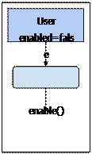
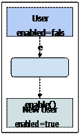
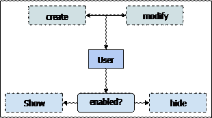
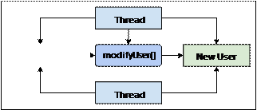
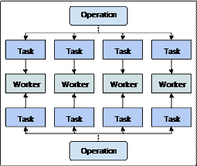
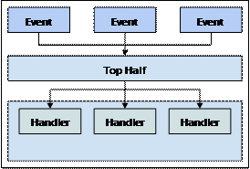

## 实用的并行化

在上一章中，我们大致学习了Web workers的基本功能。我们在浏览器中使用Web worker实现真正的并行，因为

它们映射到实际的线程上，而这些线程又映射到独立的CPU上。本章放在这里，首次提供设计并行代码的一些动力。


我们首先简要介绍一下从函数式编程中借鉴的一些方法，以及它们如何能很好的适用于并发性问题。然后，我们将

决定应该通过并行计算还是简单地在一个CPU上运行来解决并行有效性的问题。然后，我们将深入研究一些可以从

并行运行的任务中受益的并发问题。我们还将解决在使用workers线程时保持DOM响应的问题。


### 函数式编程

函数显然是函数式编程的核心。其实，就是数据在我们的应用程序中流转而已。实际上，数据及其它在程序中的

流转可能与函数本身的实现同样重要，至少就应用程序设计而言。


函数式编程和并发编程之间存在很强的亲和力。在本节中，我们将看看为什么是这样的，以及我们如何应用函数式

编程技术编写更强的并发代码。


#### 数据输入，数据输出

函数式编程相对其他编程范式是很强大的。这是一个解决同样问题的不同方式。我们使用一系列不同的工具。

例如，函数就是积木，我们将利用它们来建立一个关于数据转换的抽象。命令式编程，从另一方面来说，

使用构造，比如说类来构建抽象。与类和对象的根本区别是它们喜欢封装一些东西，而函数通常是数据流入，

数据流出。


例如，假设我们有一个带有enabled属性的用户对象。我们的想法是，enabled属性在某些给定时间会有

一个值，也可以在某些给定时间改变。换句话说，用户改变状态。如果我们将这个对象传递给我们应用程序

的不同模块，那么状态也会随之传递。它被封装为一个属性。引用用户对象的这些组件中的任何一个都可以

改变它，然后将其传递到其他地方。等等。下面的插图显示了一个函数在将用户传递给另一个组件之前如何

改变其状态：




在函数式编程中不是这样的。状态不是封装在对象内部，然后从组件传递到另一个组件;不是因为这样做本质上

是坏的，而是因为它只是解决问题的另一种方式。状态封装是面向对象编程的目标，而函数式编程的关注的是

从A点到B点并沿途转换数据。这里没有C点，一旦函数完成其工作就没有意义 - 它不关心数据的状态。这里是

上图的函数替代方案：




我们可以看到，函数方法使用更新后的属性值创建了一个新对象。该函数将数据作为输入并返回新数据作为输出。

换句话说，它不会修改输入数据。这是一个简单的方法，但会有重要的结果，如不变性。


#### 不变性

不可变数据是一个重要的函数式编程概念，非常适合并发编程。JavaScript是一种多范式语言。也就是说，

它是函数式的，但也可以是命令式的。一些函数式编程语言严格遵循不变性 - 你根本无法改变对象的状态。

这实际上是很好的，它拥有选择何时保持数据不可变性以及何时不需要的灵活性。


在上一节的最后一张图中，展示了enable()函数实际返回一个具有与输入值不同的属性值的全新对象。这样

做是为了避免改变输入值。虽然，这可能看起来很浪费 - 不断建立新对象，但实际上并非如此。综合考虑当

对象永远不会改变时我们不必写的标记代码。


例如，如果用户的enabled属性是可变的，则这意味着使用此对象的任何组件都需要不断检查enabled属性。

以下是对此的看法：




只要组件想要向用户显示，就需要不断进行此检查。我们实际上在使用函数方法时需要执行同样的检查。

但是，函数式方法唯一有效的起点是创建路径。如果我们系统中的其他内容可以更改enabled的属性，那么我们需要

担心创建和修改路径。消除修改路径还消除了许多其他复杂性。这些被称为副作用。


副作用和并发性并不好。事实上，这是一个对象可以改变的方法，这使得并发变得困难。例如，假设我们有

两个线程想要访问我们的用户对象。他们首先需要获取对它的访问权限，它可能已被锁定。以下是该方法的示图：


在这里，我们可以看到第一个线程锁定用户对象，阻止其他线程访问它。第二个线程需要等到它解锁才能继续。

这称为资源占用，它减弱了利用多核CPU的整个目的。如果线程等待访问某种资源，则它们并不真正是在并行运行。

不可变性可以解决资源占用问题，因为不需要锁定不会改变的资源。

以下是使用两个线程的函数方法：




当对象不改变状态，任意数量的线程可以同时访问他们没有任何风险破坏对象的状态，由于乱序

操作并且无需浪费宝贵的CPU时间等待的资源。


#### 引用透明度和时间

将不可变数据作为输入的函数称为具有引用透明性的函数。这意味着给定相同的输入对象，无论调用

多少次，该函数将始终返回相同的结果。这是一个有用的属性，因为它意味着从处理中删除时间因素。

也就是说，唯一可以改变函数输出结果的因素是它的输入 - 而不是相对于其他函数调用的时间。


换句话说，引用透明函数不会产生副作用，因为它们使用不可变数据。因此，时间缺乏是函数输出的

一个因素，它们非常适合并发环境。让我们来看一个不是引用透明的函数：

```javascript
//仅当对象“enabled”时，返回给定对象的“name”属性。
//这意味着如果传递给它的用户永远不更新
//“enabled”属性，函数是引用透明的。
function getName(user) {
	if (user.enabled) {
		return user.name;
	}
}

//切换传入的“user.enabled”的属性值。
//像这样改变了对象状态的函数
//使引用透明度难以实现
function updateUser(user) {
	user.enabled = !user.enabled;
}

//我们的用户对象 
var user = {
	name: 'ES6',
	enabled: false
};

console.log('name when disabled', '"${getName(user)}"`);
//→name when disabled “undefined”

//改变用户状态。现在传递这个对象
//给函数意味着它们不再存在
//引用透明，因为他们可以
//根据此更新生成不同的输出。
updateUser(user);

console.log('name when enabled',`"${getName(user)}"`);
//→name when enabled "ES6"
```

该方式的getName()函数运行依赖于传递给它的用户对象的状态。如果用户对象是enabled，则返回name。否则，

我们没有返回。这意味着如果函数传入可变数据结构，则该函数不是引用透明的，在前面的示例中就是这种情况。

enabled属性改变，函数的结果也会改变。让我们修复这种情况，并使用以下代码使其具有引用透明性：

```javascript
//“updateUser()”的引用透明版本，
//实际上它什么也没有更新。它创造了一个
//具有与传入的对象所有属性值相同的新对象，
//除了改变“enabled”属性值。
function updateUserRT(user) {
	return Object.assign({}, user, {
		enabled: !user.enabled
	});
}

//这种方法对“user”没有任何改变，
//表明使用“user”作为输入的任何函数，
//都保持引用透明。
var updatedUser = updateUserRT(user);

//我们可以在任何时候调用referentially-transparent函数，
//并期望获得相同的结果。
//当这个对我们的数据没有副作用时，
//并发性就变得更容易。
setTimeout(()=> {
	console.log('still enabled', `"${getName(user)}"`);
	//→still enabled "ES6"
}, 1000);

console.log('updated user', `"${getName(updatedUser)}"`);
//→updated user "undefined"
```

我们可以看到，updateUserRT()函数实际上并没有改变数据，它会创建一个包含更新的属性值的副本。这意味着

我们可以随时使用原始用户对象作为输入来调用updateUser()。


这种函数式编程技术可以帮助我们编写并发代码，因为我们执行操作的顺序不是一个影响因素。让异步操作有序执行

很难。不可变数据带来引用透明性，这带来更强的并发语义。
 

### 我们需要并行吗？

对于一些问题，并行性可以对我们非常有用。创建workers并同步他们之间的通信让执行任务不是免费的。

例如，我们可以使用这个可以很好的，通过深思熟虑的并行代码，使用四个CPU内核。但事实证明，执行样板

代码以促进这种并行性所花费的时间超过了在单个线程中简单处理数据所花费的。


在本节中，我们将解决与验证我们正在处理的数据以及确定系统硬件功能相关的问题。对于并行执行根本

没有意义的场景，我们总是希望有一个同步反馈选项。当我们决定并行时，我们的下一个工作就是弄清楚

工作如何分配给worker。所有这些检查都在运行时执行。


#### 数据有多大？

有时，并行并不值得。并行的方法是在更短的时间内计算更多。这样可以更快地得到我们的结果，

最终带来更迅速的用户体验。话虽如此，有些情况下我们处理简单数据时使用多线程并不是合理的。

即使是一些大型数据集也可能无法从并行化中受益。


确定给定操作对于并行执行的适合程度的两个因素是数据的大小以及我们对集合中的每个项执行的

操作的时间复杂度。换句话说，如果我们有一个包含数千个对象的数组，但是对每个对象执行的计算

都很简便，那么就没有必要使用并行了。同样，我们可能拥有一个只有很少对象的数组，但操作很复杂。

同样，我们可能无法将工作细分为较小的任务，然后将它们分发给worker线程。


我们执行的各个项的计算是静态因素。在设计时，我们必须要有一个总体思路该代码在CPU运行周期中

是复杂的还是简便的。这可能需要一些静态分析，一些快速的基准，是一目了然的还是夹杂着诀窍和直觉。

当我们制订一个标准，来确定一个给定的操作是否非常适合于并行执行，我们需要结合计算本身与数据的大小。


让我们看一个使用不同性能特征来确定给定函数是否应该使用并行执行的示例：

```javascript
//此函数确定操作是否应该并行执行。
//它需要两个参数 - 要处理的数据data
//和一个布尔标志expensiveTask，
//表示该任务对数据中的每个项执行是否复杂
function isConcurrent(data, expensiveTask) {
	var size, 
		isSet = data instanceof Set,
		isMap = data instanceof Map;

	//根据data的类型，确定计算出数据的大小
	if (Array.isArray(data)) {
		size = data.length
	} else if (isSet || isMap) {
		size = data.size;
	} else {
		size = Object.keys(data).length;
	}

	//确定是否超过数据并行处理大小的门槛，
	//门槛取决于“expensiveTask”值。
	return size >= (expensiveTask ? 100: 1000);
}

var data = new Array(138);

console.log('array with expensive task', isConcurrent(data, true));
//→array with expensive task true

console.log('array with inexpensive task', isConcurrent(data, false));
//→array with expensive task false

data = new Set(new Array(100000).fill(null).map((x, i) => i));

console.log('huge set with inexpensive task', isConcurrent(data, false));
//→huge set with inexpensive task true
```

这个函数很方便，因为它是一个简单的前置检查让我们执行 - 看需要并行还是不需要并行。如果不需要是，

那么我们可以采取简单计算结果的方法并将其返回给调用者。如果它是需要的，那么我们将进入下一阶段，

弄清楚如何将操作细分为更小的任务。


该isParallel()函数考虑到的不仅是数据的大小，还有数据项中的任何一项执行计算的成本。这让我们

可以微调应用程序的并发性。如果开销太大，我们可以增加并行处理阈值。如果我们对代码进行了一些

更改，这些更改让以前简便的函数，变得复杂。我们只需要更改expensiveTask标志。


> 当我们的代码在主线程中运行时，它在worker线程中运行时会发生什么？这是否意味着我们必须写下
> 两次任务代码：一次用于正常代码，一次用于我们的workers？我们显然想避免这种情况，所以我们需要
> 保持我们的任务代码模块化。它需要能在主线程和worker线程中都可用。


#### 硬件并发功能

我们将在并发应用程序中执行的另一个高级检查是我们正在运行的硬件的并发功能。这将告诉我们要创建多少

web workers。例如，通过在只有四个CPU核心的系统上创建32个web workers，我们真的得不到什么好处的。

在这个系统上，四个web workers会更合适。那么，我们如何得到这个数字呢？


让我们创建一个通用函数，来解决这个问题：

```javascript
//返回理想的Web worker创建数。
function getConcurrency(defaultLevel = 4) {

	//如果“navigator.hardwareConcurrency”属性存在，
	//我们直接使用它。否则，我们返回“defaultLevel”值，
	//这个值在实际的硬件并发级别上是一个合理的猜测值。
	return Number.isInteger(navigator.hardwareConcurrency) ? 
			navigator.hardwareConcurrency : 
			defaultLevel;
}

console.log('concurrency level', getConcurrency());
//→concurrency level 8
```

由于并非所有浏览器都实现了navigator.hardwareConcurrency属性，因此我们必须考虑到这一点。如果我们

不知道确切的硬件并发级别，我们必须做出猜测。在这里，我们说4是我们可能遇到的最常见的CPU核心数。

由于这是一个默认参数值，因此它作用于两点：调用者的特殊情况处理和简单的全局更改。


> 还有其他技术试图通过生成worker线程并对返回数据的速率进行采样来测量并发级别。这是一种有趣的技术，
> 但由于涉及的开销和一般不确定性，因此不适合生产应用。换句话说，使用覆盖我们大多数用户系统的静态值
> 就足够了。


#### 创建任务和分配工作

一旦我们确定一个给定的操作应该并行执行，并且我们知道要根据并发级别创建多少workers，就可以创建一些任务，

并将它们分配给workers。从本质上讲，这意味着将输入数据切分为较小的块，并将这些数据传递给将我们的任务

应用于数据子集的worker。


在前一章中，我们看到了第一个获取输入数据并将其转化为任务的示例。一旦工作被拆分，我们就会产生一个

新worker，并在任务完成时终止它。像这样创建和终止线程根据我们正在构建的应用程序类型，这可能不是

理想的方法。例如，如果我们偶尔运行一个可以从并行处理中受益的复杂操作，那么按需生成workers可能是有

意义的。但是，如果我们频繁的并行处理，那么在应用程序启动时生成线程可能更有意义，并重用它们来处理很多

类型的任务。以下是有多少操作可以为不同任务共享同一组worker的说明：




这种配置允许操作发送消息到已在运行的worker线程，并得到返回结果。当我们正在处理他们的时候，这里

没有与生成新worker和清理它们相关的开销。目前仍然是问题的和解。我们将操作拆分为较小的任务，每个

任务都返回自己的结果。然而，该操作被期望返回一个单一的结果。所以当我们将工作分成更小的任务，

我们还需要一种方法将任务结果合并到一个整体中。


让我们编写一个通用函数来处理将工作分成任务并将结果整合在一起以进行协调的样板方法。当我们在用

它的时候，我们也让这个函数确定操作是否应该并行化，或者它是应该在主线程中同步运行。首先，

让我们看一下我们要针对每个数据块并行运行的任务本身，因为它是切片的：

```javascript
//根据提供的参数返回总和的简单函数。
function sum(...numbers) {
	return numbers.reduce((result, item) => result + item);
}
```

此任务保持我们的worker代码以及在主线程中运行的应用程序的其他部分分开。原因是我们要在以下两个环境

中使用此函数：主线程和worker线程。现在，我们将创建一个可以导入此函数的worker，并将其与在消息中

传递给worker的任何数据一起使用：

```javascript
//加载被这个worker执行的通用任务
importScripts('task.js');

if (chunk.length) {
	addEventListener('message', (e) => {

		//如果我们收到“sum”任务的消息，
		//然后我们调用我们的“sum()”任务，
		//并发送带有操作ID的结果。
		if(e.data.task === 'sum') {
			postMessage({
				id: e.data.id，
				value: sum(...e.data.chunk)
			});
		}
	});
}
```

在本章的前面，我们实现了两个实用函数。所述isConcurrent()函数确定运行的操作是否作为一组较小

的并行任务。另一个函数getConcurrency()确定我们应该运行的并发级别。我们将在这里使用这两个

函数，并将介绍两个新的实用函数。事实上，这些是将在后面帮助我们的生成器。我们来看看这个：

```javascript
//此生成器创建一系列的workers来匹配系统的并发级别。
//然后，作为调用者遍历生成器，即下一个worker是
//yield的，直到最后结束。然后我们再重新开始。
//这就像一个循环赛用于选择workers来发送消息。
function* genWorkers() {
	var concurrency = getConcurrency();
	var workers = new Array(concurrency);
	var index = 0;

	//创建workers，将每个存储在“workers”数组中。
	for (let i = 0; i < concurrency; i++) {
		workers[i] = new Worker('worker.js');

		//当我们从worker那里得到一个结果时，
		//我们通过ID将它放在适当的响应中 
		workers[i].addEventListener('message', (e) => {
			var result = results[e.data.id];
			
			result.values.push(e.data.value);

			//如果我们收到了预期数量的响应，
			//我们可以调用该操作回调，
			//将响应作为参数传递。
			//我们也可以删除响应，
			//因为我们现在是在处理它。
			if (result.values.length === result.size) {
				result.done(...result.values);
				delete results[e.data.id];
			}
		});
	}

	//只要他们需要，就继续生成workers。
	while (true) {
		yield workers[index] ? 
		workers[index++] : 
		workers[index = 0];
	}
}

//创建全局“worker”生成器。
var workers = genWorkers();

//这将生成唯一ID。我们需要它们
//将Web worker执行的任务映射到
//更大的创建它们的操作上。
function* genID() {
	var id = 0;
	while (true) {
		yield id++;
	}
}

//创建全局“id”生成器。
var id = genID();
```

伴随着这两个生成器的位置 - workers和id - 我们现在就已经可以实现我们的parallel()高阶函数。我们的

想法是将一个函数作为输入以及一些其他参数，这些参数允许我们调整并行化的行为并返回一个可以在整个应用

程序中正常调用的新函数。我们现在来看看这个函数：

```javascript
//构建一个在调用时运行给定任务的函数
//在worker中将数据拆分成块。
function parallel(expensive, taskName, taskFunc, doneFunc) {

	//返回的函数将数据作为参数处理，
	//以及块大小，具有默认值。
	return function(data, size = 250) {

		//如果数据不够大，函数也并不复杂，
		//那么只需在主线程中运行即可。
		if (!isConcurrent(data, expensive)) {
			if (typeof taskFunc === 'function') {
				return taskFunc(data);
			} else {
				throw new Error('missing task function');
			}
		} else {
			//此调用的唯一标识符。
			//用于协调worker结果时。
			var operationID = id.next().value;

			//当我们将它切成块时，
			//用于跟踪数据的位置。
			var index = 0;
			var chunk;

			//全局“results”对象得到一个包含有关此操作的数据对象。
			//“size”属性表示我们期待的返回结果数量。
			//“done”属性是所有结果被传递给的回调函数。
			//并且“values”存着来自workers的结果。
			result[operationID] = {
				size: 0,
				done: doneFunc,
				values: []
			};

			while (true) {
				//获取下一个worker。
				let worker = workers.next().value;
				
				//从输入数据中切出一个块。
				chunk = data.slice(index, index + size);
				index += size;

				//如果要处理一个块，我们可以增加预期结果的大小，
				//并发布一个给worker的消息。
				//如果没有块的话，我们就完成了。
				if (chunk.length) {
					results[operationID].size++;
					
					worker.postMessage({
						id: operationID,
						task: taskName,
						chunk: chunk
					});
				} else {
					break;
				}
			}
		}
	};
}

//创建一个要处理的数组，使用整数填充。
var array = new Array(2000).fill(null).map((v, i) => i);

//创建一个“sumConcurrent()”函数，
//在调用时，将处理worker中的输入数据。
var sumConcurrent = parallel(true, 'sum', sum,
	function(...results) {
		console.log('results', results.reduce((r, v) => r + v));
	});

sumConcurrent(array);
```

现在我们可以使用parallel()函数来构建在整个应用程序中调用的并发函数。例如，当我们必须计算

大量输入的总和，就可以使用sumConcurrent()函数。唯一不同的是输入数据。


> 这里一个明显的限制是我们只有一个回调函数，我们可以在并行化函数完成时指定。
> 而且，这里有很多标记要做 - 用ID来协调任务与他们的操作有些痛苦; 这感觉好像我们正在实现promise。
> 这是因为这基本上就是我们在这里所做的。下一章将详细介绍如何将promise与worker相结合，以避免混乱的抽象，
> 例如我们刚刚实现的抽象。


### 候选的问题

在上一节中，你学习了如何创建一个通用函数，该函数将在运行中决定如何使用worker划分和实施，

或者在主线程中简单地调用函数是否更有利。既然我们已经有了通用的并行化机制，我们可以解决哪些问题？

在本节中，我们将介绍从稳固的并发体系结构中受益的最典型的并发方案。


#### 令人尴尬的并行

如何将较大的任务分解为较小的任务时，很明显就是个令人尴尬的并行问题。这些较小的任务不依赖于彼此，

这使得开始执行输入并生成输出而不依赖于其他workers状态的任务变得更加容易。这又回到了函数式编程，

以及引用透明性和没有副作用的方法。


这些类型的问题是我们想要通过并发解决的 - 至少首先，在我们的应用首次实施时是困难的。就并发问题而言，

这些都是悬而未决的结果，它们应该很容易解决而不会冒提供功能能力的风险。


我们在上一节中实现的最后一个示例是一个令人尴尬的并行问题，我们只需要每个子任务来添加输入值并

返回它们。当集合很大且非结构化时，全局搜索是另一个例子，我们很少花费工作来分成较小的任务并将

它们合并出结果。搜索大文本输入是一个类似的例子。mapping和reducing是另一个需要相对较少的并行化

工作的例子。


#### 搜索集合

一些集排过序。可以有效地搜索这些集合，因为二进制搜索算法能够简单地基于数据被排序的前提来避免

大部分数据查找。然而，有时我们使用的是非结构化或未排序的集合。在有些情况下，时间复杂度可能

是O(n)，因为需要检查集合中的每一项，不能做出任何假设。


大量文本是非结构化集合的一个典型的例子。如果我们要在这个文本中搜索一个子字符串，那么就没有

办法避免根据我们已经查找过的内容搜索文本的一部分 - 需要覆盖整个搜索空间。我们还需要计算大量

文本中子字符串出现次数。这是一个令人尴尬的并行问题。让我们编写一些代码来计算字符串输入中子

字符串出现次数。我们将复用在上一节中创建的并行工具函数，特别是parallel()函数。

这是我们将要使用的任务：

```javascript
//统计在“collection”中“item”出现的次数
function count(collection, item) {
	var index = 0,
		occurrences = 0;
		
	while (true) {

		//找到第一个索引。
		index = collection.indexOf(item, index);

		//如果我们找到了，就增加计数，
		//然后增加下一个的起始索引。
		//如果找不到，就退出循环。
		if (index > -1) {
			occurrences += 1;
			index += 1;
		} else {
			break;
		}
	}

	//返回找到的次数。
	return occurrences;
}
```

现在让我们创建一个文本块供我们搜索，并使用并行函数来搜索它：

```javascript
//我们需要查找的非结构化文本。
var string =`Lorem ipsum dolor sit amet，mei zril aperiam sanctus id，duo wisi aeque 
molestiae ex。Utinam pertinacia ne nam，eu sed cibo senserit。Te eius timeam docendi quo，
vel aeque prompta philosophia id，necut nibh accusamus vituperata。Id fuisset qualisque
cotidieque sed，eu verterem recusabo eam，te agam legimus interpretaris nam。EOS 
graeco vivendo et，at vis simul primis`;

//使用我们的“parallel()”工具函数构造一个新函数 - “stringCount()”。
//通过迭代worker计数结果来实现记录字符串的数量。
var stringCount = parallel(true, 'count', count,
	function(...results) {
		console.log('string', results.reduce((r, v) => r + v));
	});

//开始子字符串计数操作。
stringCount(string, 20, 'en');
```

在这里，我们将输入字符串拆分为20个字符块，并且搜索的输入值en。结果找到3个结果。让我们看看

是否能够使用这项任务，随着我们并行worker工具和统计出现的次数在一个数组中。

```javascript
//创建一个介于1和5之间的10,000个整数的数组.
var array = new Array(10000).fill(null).map(() => {
	return Math.floor(Math.random() * (5 - 1)) + 1;
});

//创建一个使用“count”任务的并行函数，
//计算在数组中出现的次数。
var arrayCount = parallel(true, 'count', count, function(...results) {
	console.log('array', results.reduce((r, v) => r + v));
});

//我们查找数字2 - 可能会有很多。
arrayCount(array, 1000, 2);
```

由于我们使用随机整数生成这个10,000元素数组，因此每次运行时输出会有所不同。但是，我们的并行

worker工具的优点是我们能够以更大的块调用arrayCount()。


> 您可能已经注意到我们正在过滤输入，而不是在其中找到特定项。这是一个令人尴尬的并行
> 问题的例子，而不是使用并发解决的问题。我们之前的过滤代码中的worker节点不需要彼此通信。
> 如果我们有几个worker节点都寻找某一个项，我们将不可避免地面临提前终止的情况。

> 但要处理提前终止，我们需要worker以某种方式相互通信。这不一定是坏事，只是更多的共享状态和更多的
> 并发复杂性。这样的结果在并发编程中变得相关 - 我们是否在其他地方优化以避免某些并发性挑战？


#### Mapping和Reducing

JavaScript中的Array原生语法已经有了map()方法。我们现在知道，有两个关键因素会影响给定

输入数据集运行给定操作的可伸缩性和性能。它是数据的大小乘以应用于此数据中每个项上的任务

复杂度。如果我们将大量数据放到一个数组，然后使用复杂的代码处理每个数组项，这些约束可能

会导致我们的应用程序出现问题。


让我们看看用于过去几个代码示例的方法是否可以帮助我们将一个数组映射到另一个数组，而不必担心在

单个CPU上运行的原生Array.map()方法 - 一个潜在的瓶颈。我们还将解决迭代大数据集合的问题。

这与mapping类似，只有我们使用Array.reduce()方法。以下是任务函数：

```javascript
//一个“plucks”给定的基本映射
//从数组中每个项的“prop”。
function pluck(array, prop) {
	return array.map((x) => x[prop]);
}

//返回迭代数组项总和的结果。
function sum(array) {
	return array.reduce((r, v) => r + v);
}
```

现在我们有了可以从任何地方调用的泛型函数 - 主线程或worker线程。我们不会再次查看worker代码，因为

它使用与此之前的示例相同的模式。它确定要调用的任务，并格式化处理发送回主线程的响应。让我们继续

使用parallel()工具函数来创建一个并发map函数和一个并发reduce函数：

```javascript
//创建一个包含75,000个对象的数组。
var array = new Array(75000).fill(null).map((v, i) => {
	return {
		id: i,
		enabled: true
	};
});

//创建一个并发版本的“sum()”函数
var sumConcurrent = parallel(true, 'sum', sum,
	function(...results) {
		console.log('total', sum(results));
	});

//创建一个并发版本的“pluck()”函数。
//当并行任务完成时，将结果传递给“sumConcurrent()”。
var pluckConcurrent = parallel(true, 'pluck', pluck,
	function(...results) {
		sumConcurrent([].concat(...results));
	});

//启动并发pluck操作。
pluckConcurrent(array, 1000, 'id');
```

在这里，我们创建了75个任务分发给workers(75000/1000)。根据我们的并发级别，这意味着我们将同时

从数组项中提取多个属性值。reduce任务以相同方式工作; 我们并发的计算映射的集合。我们仍然需要

在sumConcurrent()回调进行求和，但它很少。


> 执行并发迭代任务时我们需要谨慎。Mapping是简单的，因为我们创建的是一个原始数组的大小和排序
> 方面的克隆。这是不同的值。Reducing可能是依赖于该结果作为它目前的立场。不同的是，因为每个数组
> 项通过迭代函数，它的结果，因为它被创建，可以改变的最终结果输出。
> 并发使得这个变得困难，但在此之前的例子，该问题是尴尬的并行 - 不是所有的迭代工作都是。


### 保持DOM响应

到本章这里，重点已经被数据中心化了 - 通过使用web worker来对获取输入和转换进行分割和控制。

这不是worker线程的唯一用途; 我们也可以使用它们来保持DOM对用户的响应。


在本节中，我们将介绍一个在Linux内核开发中使用的概念，将事件分成多个阶段以获得最佳性能。

然后，我们将解决DOM与我们的worker之间进行通信的挑战，反之亦然。


#### Bottom halves

Linux内核具有top-halves和bottom-halves的概念。这个想法被硬件中断请求机制使用。问题是硬件中断

一直在发生，而这是内核的工作，以确保它们都是及时捕获和处理的。为了有效地做到这一点，内核将

处理硬件中断的任务分为两半 - top-halves和bottom-halves。


top-halves的工作是响应外部触发，例如鼠标点击或击键。但是，top-halves受到严格限制，这是故意的。

处理硬件中断请求的top-halves只能安排实际工作 - 所有其他系统组件的调用 - 以后再进行。后面的

工作是在bottom-halves完成的。这种方法的副作用是中断在低级别迅速处理，在优先级事件方面允许更大

的灵活性。


什么内核开发工作必须用到JavaScript和并发？好了，它变成了我们可以借用这些方法，并且我们的

“bottom-half”的工作委托给一个worker。我们的事件处理代码响应DOM事件实际上什么也不做，除了

传递的消息给worker。这确保了在主线程中只做它绝对需要做而没有任何额外的处理。这意味着，

如果Web worker返回的结果要展示，它可以马上这么做。请记住，在主线程包括渲染引擎，它阻止我们

运行的代码，反之亦然。

这是处理外部触发的top-halves和bottom-halves的示图：




JavaScript是运行即完成的，我们现在已经很清楚了。这意味着在top-halves花费的时间越少，就越需要

通过更新屏幕来响应用户。与此同时，JavaScript也在我们的bottom-halves运行的Web worker中运行完成。

这意味着同样的限制适用于此; 如果我们的worker得到在短时间内发送给它的100条消息，他们将以

先入先出(FIFO)的顺序进行处理。


不同之处在于，由于此代码未在主线程中运行，因此UI组件在用户与其交互时仍会响应。对于高要求的

产品来说，这是一个至关重要的因素，值得花时间研究top-halves和bottom-halves。我们现在只需要

弄清楚实现。


#### 转换DOM操作

如果我们将Web worker视为应用程序的bottom-halves，那么我们需要一种操作DOM的方法，同时在

top-halves花费尽可能少的时间。也就是说，由worker决定在DOM树中需要更改什么，然后通知主线程。

接着，主线程必须做的就是在发布的消息和所需的DOM API调用之间进行转换。在接收这些消息和将控制权

移交给DOM之间没有数据操作; 毫秒在主线程中是宝贵的。


让我们看看这是多么容易实现。我们将从worker实现开始，该实现在想要更新UI中的内容时将DOM操

作消息发送到主线程：

```javascript
//保持跟踪我们渲染的列表项数量。
var counter = 0;

//主线程发送消息通知所有必要的DOM操作数据内容。
function appendChild(settings) {
	postMessage(settings);

	//我们已经渲染了所有项，我们已经完成了。
	if (counter === 3) {
		return;
	}

	//调度下一个“appendChild()”消息。
	setTimeout(() => {
		appendChild({
			action: 'appendChild',
			node: 'ul',
			type: 'li',
			content: `Item ${++counter}`
		});
	}, 1000);
}

//调度第一个“appendChild()”消息。
//这包括简单渲染到主线程中的DOM所需的数据。
setTimeout(() => {
	appendChild({
		action: 'appendChild',
		node: 'ul'，
		type: 'li'，
		content: `Item ${++counter}`
	});
}, 1000);
```

这项工作将三条消息发回主线程。他们使用setTimeout()进行定时，因此我们可以期望的看到每秒渲染

一个新的列表项，直到显示所有三个。现在，让我们看一下主线程代码如何使用这些消息：

```javascript
//启动worker(bottom-halves)。
var worker = new Worker('worker.js');

worker.addEventListener('message', (e) => {

	//如果我们收到“appendChild”动作的消息，
	//然后我们创建新元素并将其附加到
	//适当的父级 - 在消息数据中找到所有这些信息。
	//这个处理程序绝对是除了与DOM交互之外什么都没有
	if (e.data.action ==='appendChild') {
		let child = document.createElement(e.data.type);
		child.textContent = e.data.content;
	};

	document.querySelector(e.data.node).appendChild(child);
});
```

正如我们所看到的，我们有很少机会给top-halves(主线程)带来瓶颈，导致用户交互卡住。这很简单 - 这里

执行的唯一代码是DOM操作代码。这大大增加了快速完成的可能性，允许屏幕为用户明显更新。


另一个方向是什么，将外部事件放入系统而不干扰主线程？我们接下来会看看这个。


#### 转换DOM事件

一旦触发了DOM事件，我们就希望将控制权移交给我们的Web worker。通过这种方式，主线程可以继续运行，

好像没有其他事情发生 - 大家都很高兴。不幸的是，还有一点。例如，我们不能简单地监听

每个元素上的每一个事件，将每个元素转发给worker，如果它不断响应事件，那么它将破坏不在主线程中

运行代码的目的。


相反，我们只想监听worker关心的DOM事件。这与我们实现任何其他Web应用程序的方式没有什么不同;
 
我们的组件会监听他们感兴趣的事件。要使用workers实现这一点，我们需要一种机制来告诉主线程在特定

元素上设置DOM事件监听器。然后，worker可以简单地监听传入的DOM事件并做出相应的响应。我们先来

看一下worker的实现：

```javascript
//当“input”元素触发“input”事件时，
//告诉主线程我们想要收到通知。
postMessage({
	action: 'addEventListener',
	selector: 'input',
	event: 'input'
});

//当“button”元素触发“click”事件时，
//告诉主线程我们想要收到通知。
postMessage({
	action: 'addEventListener',
	selector: 'button',
	event: 'click'
});

//一个DOM事件被触发了。
addEventListener('message', (e) => {
	var data = e.data;

	//根据具体情况以不同方式记录
	//事件是由触发的。
	if(data.selector === 'input') {
		console.log('worker', `typed "${data.value}"`);
	} else if (data.selector === 'button') {
		console.log('worker', 'clicked');
	}
});
```

该worker要求有权访问DOM的主线程设置两个事件侦听器。然后，它为DOM事件设置自己的事件侦听器，

最终进入worker。让我们看看负责设置处理程序和向worker转发事件的DOM代码：

```javascript
//启动worker...
var worker = new Worker('worker.js');

//当我们收到消息时，这意味着worker想要
//监听DOM事件，所以我们必须设置代理。
worker.addEventListener('message', (msg) => {
	var data = msg.data;
	if (data.action === 'addEventListener') {

		//找到worker正在寻找的节点。
		var nodes = document.querySelectorAll(data.selector);

		//为给定的“event”添加一个新的事件处理程序
		//我们刚刚找到的每个节点。当那个事件发生时触发，
		//我们只是发回一条消息返回到包含相关事件数据的worker。
		for (let node of nodes) {
			node.addEventListener(data.event, (e) => {
				worker.postMessage({
					selector: data.selector,
					value: e.target.value
				});
			})
		};
	}
});
```


> 为简洁起见，只有几个事件属性被发送回worker。由于Web worker消息中的序列化限制，我们无法发送事件
> 对象。实际上，可以使用相同的模式，但我们可能会为此添加更多事件属性，例如clientX和clientY。


### 小结

前一章向我们介绍了Web workers，重点介绍了这些组件的强大功能。本章改变了方向，重点关注并行性的“why”方面。

我们通过查看函数式编程的某些方面以及它们如何适合JavaScript中的并发编程来解决问题。


我们研究了确定跨worker同时执行给定操作的可行性所涉及的因素。有时，拆分大型任务并将其作为较小的任务分发

给worker需要花费大量开销。我们实现了一些通用工具函数，帮助我们实现并发函数，封装一些相关的并发模板代码。


并非所有问题都非常适合并发解决方案。最好的方法是自上而下地工作，找出令人尴尬的并行问题，因为它们是

悬而未决的成果。然后，我们将此原则应用于许多map-reduce问题。


我们简要介绍了top-halves和bottom-halves的概念。这是一种策略，可以使主线程持续清除待处理的JavaScript

代码，以保持用户界面的响应。我们在忙于思考关于我们最有可能遇到的并发问题的类型，以及解决它们的最佳方法，

我们的代码复杂性上升了一个档次。下一章是关于将三个并发原则集合在一起的方式，它将并发性放在首位，

而不会牺牲代码的可读性。
