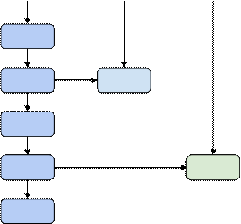
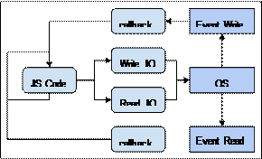
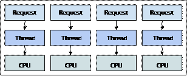
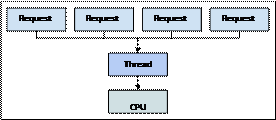
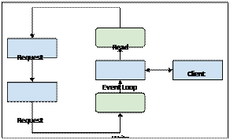
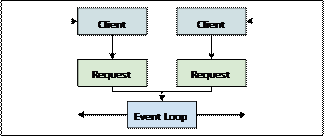
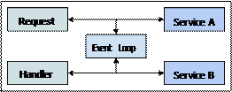
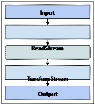

## 第八章 NodeJS中的Evented IO

NodeJS利用V8(Chrome JavaScript引擎)提供高性能的服务器环境。Node不仅限于Web服务器的范围 - 这只是最初存在于

构思上的问题。事实上，它的出现是为了解决Web开发者面临的一些棘手的并发问题。


本章的目标是解释Node如何处理并发问题，以及我们如何编写NodeJS代码以充分利用这种环境。Node和其他Web服务器环境

之间最明显的区别是它使用单个线程来处理请求，并依赖于事件IO来实现高级别的并发。然后，我们将深入研究为什么

在Web环境中使用统一的IO并发方法是有意义的。


由于IO事件循环是基于网络请求和文件操作的，因此我们将在本章的后面部分中看看各种网络IO和文件IO的示例。


### 单线程IO

NodeJS的一个常见误解是它实际上仅限于一个CPU，无法实现真正​​的并发。事实上，Node经常使用多个控制线程。我们将在

本章后面探讨这些概念。也许这是IO事件循环带来的误导，因为它确实是在一个单独的CPU上运行的。


本节的目标是介绍IO循环的概念，为什么它对大多数Web应用程序后端来说是一个不错的方法，以及它如何克服多线程并发

方法面对的挑战。


> 以下章节介绍了更高级的Node并发话题，包括事件循环伴随我们的方式。虽然事件循环是一个新颖的方法，但它并不完美;
> 对给定并发问题的每个解决方案都有负面的权衡。


#### IO是很慢的

在一个给定的网络应用基础设施中最慢的部分是网络IO和存储IO。这些发展得相当快的，主要是在过去几年中由于对物理

硬件上的改进，但相比于正在CPU上运行的软件任务，IO是龟速的。让网络应用程序在性能方面如此具有挑战性的是，有

很多IO在发生。我们不断从数据库读取和写入数据并将数据传输到客户端浏览器。IO性能是Web应用程序领域的一个主要

问题。


事件IO的根本突破在于它实际上利用了IO缓慢的这一事实。例如，假设我们有10个CPU任务排队，但首先，我们需要写一些

东西到磁盘。如果我们必须在开始执行任务之前等待写入操作完成，那么它们将花费比他们需要的更长的时间。使用事件IO，

我们发出写命令，但我们不等待低级操作系统IO写操作完成。相反，我们在IO发生时继续执行10个CPU任务。


下图说明在单个线程中运行的CPU任务，而IO任务在后台发生：




什么类型的IO操作一个给定的任务需要来执行并没有什么关系;它不会阻止其他任务运行。这是事件IO架构可以运行

在一个单独的线程上的方式。这是NodeJS所擅长的并发类型 - 并行的在大量IO工作中执行。但是，我们也需要

了解发生在操作系统级别的这些IO操作的状态。接下来，我们来看看Node如何使用这些事件来协调一个给定的文件

描述符的状态。


#### IO事件

我们的应用程序代码需要某种方式来得知IO操作已完成。这是IO事件发挥作用的地方。例如，如果一个异步读取

操作开始于我们的JavaScript代码的某个地方，该操作系统处理实际的文件读取。当它完成读取，内容就在内存中，

操作系统触发一个IO事件，表示这个IO操作已经完成。


所有主流操作系统都以某种形式支持这些类型的IO事件。NodeJS使用低级C语言库来管理这些事件，它还考虑了各种

平台差异。以下是Node IO事件循环的示意图，将各种IO任务发送到操作系统并侦听相应的IO事件：




如图所示，任何IO都在事件循环之外处理。事件循环本身只是一个运行JavaScript任务的队列。这些通常是

与IO相关的任务。我们可以看到，IO事件的结果是回调被推入队列的函数。在Node中，JavaScript不等待IO完成。

类似于前端渲染引擎，不等待在Web worker中完成较慢的计算任务。


大多数的这种情况对我们来说，那个NodeJS模块被用来执行IO。我们只需要关心回调函数。如果回调不好处理，

这很好，我们已经花了几章解决与回调地狱相关的并发性问题。这些方法都大多适用于Node; 此外，我们在下一章

会解决一些Node上独特的同步技术。


#### 多线程挑战

多年来，如果服务Web请求的主要方法是多线程，那么就不会奇怪事件IO是什么？此外，在单个CPU上运行我们所有的

JavaScript代码几乎没有利用任何可能运行的多核系统的优势。即使我们在虚拟化环境中运行，我们也可能已经并行化

了虚拟硬件。简短的说就是，两种方法都没有错，因为它们使用不同的策略来解决类似的问题。当我们向任何一个方向

走向极端时，我们都想重新思考我们的方法; 例如，我们开始处理更多IO或更多计算。


在Web环境中，常见的情况是花费更多时间来执行IO而不是开销大的CPU刻录。当我们的应用程序的用户与之交互时，

我们通常需要通过网络进行API调用，然后我们需要读取或写入文件系统。然后，我们需要对网络进行响应。除非

这些请求在计算中进行了大量的数据处理，否则大部分时间都花在执行IO操作上。


那么，是什么让IO密集型应用程序不适合多线程方法呢？好吧，如果我们想要生成新线程或者使用一个线程池，那么

将会涉及很多内存开销。可以想象一个线程，它将请求作为一个进程提供给它自己的内存块。如果我们有很多传入请求，

那么我们可以并行处理它们。然而，我们仍然必须执行IO。在没有事件循环的情况下进行IO同步有点棘手，因为我们

必须在等待IO操作完成时为当前请求保持线程是开启的。


这种模式是很难扩展的，一旦我们开始使用大量的IO。但是，对于一般应用，就没有必要抛弃它。同样，如果我们的

应用程序改变一下，需要大量CPU资源对于任何给定的请求，一个单线程事件循环可能不会削减它。现在我们有一个

基本的了解了，对于IO密集型Web应用程序，是什么使得IO事件循环成为一个强有力的东西，现在是时候来看看

事件循环的其他一些特性。


### 更多的连接，更多的问题

在本节中，我们将解决构建在互联网连接世界中运行的应用程序所带来的挑战。在这个混乱的环境中，可能会发生

意想不到的事情; 主要是，大量的用户使用转化为大量的用户同时连接。在本节中，我们将介绍在部署到面向

Internet的环境时需要担心的是什么。然后我们将看看C10K问题 - 10,000个用户连接到具有有限硬件资源的应用

程序。我们将以仔细查看实际在NodeJS事件循环中运行的事件处理程序来结束本节。


#### 部署到Internet

Internet是一个不错的而又残酷的环境，可以部署我们的应用程序。我们的用户只需要一个浏览器和一个URL。如果我们

提供人们想要的东西，并且他们对这种东西的需求持续增长，我们很快就会面临连接挑战。这可能是人气逐渐增加，或突然

飙升。在任何一种情况下，我们都必须处理这些可扩展性挑战。


由于我们的应用程序面向公众，因此我们很有可能拥有以计算为中心的社交功能。另一方面，这通常意味着存在大量

连接，每个连接都执行自己的IO密集型操作。这听起来非常适合IO事件循环，就像在NodeJS中找到的那样。


互联网实际上是测试我们应用程序多功能性的完美环境。如果有一个观众想要更多的东西，你会在这里找到它。假设

我们的应用程序是有用且需要的，我们可以亲眼看到我们如何经得起数以万计的连接。我们可能没有一个巨大的基础

设施支持我们，所以我们必须对我们的硬件资源负责。


NodeJS并发能否有效地应对这样的环境？它当然可以，但要注意; 这些受众对失败的请求或甚至次优的性能都具有

零容忍度。


#### C10K问题

Dan Kegel在1999年开始考虑C10K问题(http://www.kegel.com/c10k.html)。所以最初的想法是接近20年前;
 
从那以后硬件已经走过了漫长的道路。但是，将10,000个并发用户连接到应用程序的想法今天仍然有用。事实上，

现代版本的这个问题可能应该是C25K，因为对于大多数人会考虑负担得起的服务器硬件或虚拟硬件，我们可以拿出比

1999年更多的性能。


在这第二个原因问题的范围已经增长是由于互联网人口增长的。这里有一点是巨大的连接用户和设备相比在1999年。

在C10K时代有一件事是没有改变的 - 大量的连接所需的高效性能没有一个足够大的基础设施来支持它。例如，

这里有一个示图显示了映射到系统上的线程的传入请求：




随着连接用户数量的增长，请求数量也会增加。我们需要使用这种方法很快扩展我们的物理基础设施，因为它本身依赖

于并行处理请求。事件IO循环也并行处理请求，但使用不同的策略，如下所示：




由于CPU的数量不同，我们的应用程序无法处理大量的连接数。这是因为我们的JavaScript代码在一个CPU上

的一个线程中线性运行。但是，我们编写的在IO循环中运行的JavaScript代码类型起着重要作用，我们将在

下面看到。


#### 轻量级事件处理程序

NodeJS的假设是我们不会花太多时间，相对执行JavaScript代码来说。换句话说，当请求到达Node应用程序时，处理

请求的JavaScript代码是短暂的。它计算出它需要执行的IO，可能是通过从文件系统中读取并退出，将控制权交还给IO

循环。


但是，没有什么可以强制我们的JavaScript代码小而高效。有时，由于我们的应用程序功能发生变化，或引入了将转向

另一个方向的新功能，因此CPU密集型代码是不可避免的。如果发生这种情况，我们必须采取必要的纠正设计步骤，

因为失控的JavaScript处理程序会对我们所有的连接造成严重破坏。


让我们看看Node事件循环，运行良好的JavaScript任务类型以及哪些可能导致问题：

```javascript
//消耗一些CPU...
//源自http://adambom.github.io/parallel.js/
function work(n) {
	var i = 0;
	while(++i < n * n) {}
	return i;
}

//队列中没有处理程序，所以这是立即执行 
process.nextTick(() => {
	console.log('first handler');
});

//上一个处理程序很快就退出了，
//所以这个处理程序执行没有延迟。
process.nextTick(() => {
	console.log('second handler');
});


//立即启动因为前一个处理程序很快退出，
//但是，该处理程序执行一些CPU密集型代码。
process.nextTick(() => {
	console.log('hogging the CPU...');
	work(100000);
});

//这个处理程序不会立即运行，
//因为在此之前的处理程序需要一段时间才能完成。
process.nextTick(() => {
	console.log('blocked handler');
});
```

所述process.nextTick()函数是一个进入Node IO事件循环的入口点。实际上，核心Node模块在整个地方都使用了

这个函数。每个事件循环迭代称为tick。因此，我们通过使用回调调用此函数所做的就是 - 将此函数添加到要在

下一个循环迭代中调用的函数队列中。


在给定的循环迭代中可能有数百甚至数千个回调要处理。这没关系，因为在这些回调中没有在IO上等待。因此，

除了当我们启动占用大量CPU周期的任务时，单个线程足以处理Web请求。前一个示例中的处理程序就是这样做的。

返回需要几秒钟，而这一过程中，事件循环被卡住了。我们在CPU开销大的处理程序之后添加的处理程序不会运行。

当有数千个连接的客户端等待响应时，后果将是灾难性的。


> 当我们考虑创建Node进程集群时，我们将在下一章深入解决这个问题，每个集群都有自己的事件循环。


### 事件网络IO

NodeJS擅长提供HTTP请求。这是因为给定的请求生命周期在客户端和服务器之间花费了很多时间。在此期间，

Node处理其他请求。在本节中，我们将介绍Node的一些HTTP网络功能，以及它们如何适应IO事件循环。


我们首先看一下基本的HTTP请求，以及它们如何作为许多Node模块和项目的基础。然后，我们将转向客户端

流式响应，它不是一次性发送大量数据。最后，我们将了解Node服务器如何将请求代理到其他服务。


#### 处理HTTP请求

NodeJS中的http模块负责处理有关创建和设置HTTP服务器的所有细节。毫无疑问，这个模块被许多创建Web服务器

的Node项目大量使用。它甚至还有一个辅助函数，并为我们创建服务器，设置回调函数用于响应传入请求。

这些回调获得request参数和response参数。请求包含从客户端发送的信息，我们通常从该对象读取。响应包含发送

回客户端的信息，我们通常会写入此对象。这是一个示图，展示将这两个概念放入IO事件循环的上下文中：




一开始看起来反直觉，客户端直接与事件循环通信。嗯，这实际上是近似于真实情况。该request和response对象只是

在我们的JavaScript代码给我们访问的抽象。它们的存在是为了帮助我们读取和写入正确的套接字数据。这些抽象

将正确的数据传递给套接字或读取正确的套接字数据。在这两种情况下，我们的代码都会比发生真实客户端通信

的事件循环延迟一些。


我们现在来看一些基本的HTTP服务器代码。

```javascript
//我们需要与HTTP相关的“http”模块代码
var http = require('http');

//创建服务器实例和
//一系列在每个请求上调用的回调函数。
var server = http.createServer((req, res) => {

	//响应头总是普通文字
	res.setHeader('Content-Type', 'text/plain');

	//如果请求URL是“hello”或“world”，
	//我们立即返回一些文字。
	//除此以外，如果请求URL是“/”，我们通过使用“setTimeout()”
	//模拟一个5秒后请求来完成响应 
	if(req.url === '/hello') {
		res.end('Hello');
	} else if (req.url === '/world') {
		res.end('World');
	} else {
		setTimeout(() => {
			res.end('Hello World');
		}, 5000);
	}
});

//启动服务器 
server.listen(8081);
console.log('listening at http://localhost:8081');
```

在此示例中，我们将纯文本发送回浏览器。我们对URL进行快速检查并相应地调整内容。虽然默认路径中有一些有趣的东西，

我们使用setTimeout()将响应延迟5秒。因此，如果我们要访问http://localhost/，页面将在显示任何内容之前

等待5秒。这里的方法是演示事件循环的异步特性。虽然此请求等待某些事情发生，但所有其他请求立即得到服务。我们

在它加载时，通过另一个选项卡加载/hello URL或/world URL来测试它。


#### 流式响应

在前面的例子中，我们用一次调用编写了整个HTTP响应内容。这通常不错，特别是在某些情况下，因为我们只在连接的

套接字上写了一些字符。对于某些应用程序，对给定请求的响应将远远大于此。例如，如果我们实现一个API调用，

客户端请求一系列实体，并且每个实体有多个属性该怎么办呢？


当我们从请求处理程序向客户端传输大量数据时，我们可能会遇到麻烦。即使我们没有执行CPU密集型计算，我们仍然会

消耗CPU并阻止其他请求处理程序，同时我们会向响应中写入大量数据。下图是这个问题的说明：




问题不一定是响应其中一个大的响应，而是当它们有很多时。在本章的前面，我们讨论了建立和维护大量连接用户的问题，

因为这对我们的应用程序来说非常常见。因此，在每个响应中返回相对大量数据的问题是整个应用程序的性能下降。

每个用户都会遇到非最佳性能，这根本不是我们想要的。


我们可以使用流技术解决这个问题。代替一次写入全部响应，我们可以以块的形式写入。作为一个块的数据被写入到响应流，

该事件循环是轻松的处理排队的请求。总体而言，我们能够避免任何一个从花更多的时间来自请求处理程序的事件循环比

什么是绝对必要的。让我们看一个例子：

```javascript
//我们需要“http”模块。
var http = require('http');

//创建一些示例数据，一个数字数组。
var array = new Array(1000)
	.fill(null)
	.map((v, i) => i);

//创建HTTP服务器和请求回调函数
var server = http.createServer((req, res) => {
	var size = 25,
		i = 0;
		
	//当我们需要调度一块要写入响应的数据时，这个函数将被调用。
	function schedule() {

		//这是实际的调度，
		//“process.nextTick()”让其他处理程序，
		//如果有的话，在我们流式传输写入的响应时运行。
		process.nextTick(() => {
			let chunk = array.slice(i, i + size);

			//如果要写一块数据，
			//写下来，然后通过调用“schedule()”调度下一轮。
			//否则，我们可以“end()”结束响应。
			if (chunk.length) {
				res.write(chunk.toString() + '\n');
				i += size;
				schedule();
			} else {
				res.end();
			}
		});
	}
});

//启动流写入调度程序。
schedule();

//启动服务器 
server.listen(8081);
console.log('listening at http://localhost:8081');
```

此示例通过以纯文本形式返回数字列表来响应客户端请求。如果我们在浏览器中查看此页面，我们实际上可以看到这些数字

是如何分块的，因为它们被新行分隔开来。这仅用于说明目的; 在实践中，我们可能会将响应用作一个大的列表。重要的是

我们的请求处理程序不再贪婪，因为通过使用流方法，我们与其他请求处理程序共享事件循环。


#### 代理网络请求

我们的主NodeJS Web服务器不需要满足每个请求的每个方面。相反，我们的处理程序可以联系到构成我们应用程序主干的

其他系统，并向他们索取数据。这是一种微服务形式，它是一个超出本书讨论范围的话题。让我们将这些服务视为独立的部分，

帮助我们构建更大的应用程序。


在一个节点的请求处理程序，我们可以创建一个其他的HTTP请求访问到这些外部服务。这些请求使用了相同的事件循环创建

它们的处理程序。例如，当该服务响应一些数据，它触发一个IO事件，和一个相应的JavaScript代码块运行。下图显示了

这种类型如何配置工作：




让我们看看是否可以编写一个请求处理程序，它实际上是存在不同服务器上的其他服务的组合。我们将首先实现用户

服务，该服务允许我们检索特定的用户信息。然后，我们将实现一个首选项服务，它允许我们获取特定用户设置的首选项。

这是用户服务代码：

```javascript
var http = require('http');

//我们的示例用户数据
var users = [
	{name: 'User 1'},
	{name: 'User 2'},
	{name: 'User 3'},
	{name: 'User 4'}
];

var server = http.createServer((req, res) => {

	//我们将返回JSON数据。
	res.setHeader('Content-Type', 'application/json');
	
	var id = /\/(\d+)/.exec(req.url),
		user;

	//如果从URL中的ID中找到用户，则返回
	//它的JSON字符串。否则，返回404.
	if (id && (user = users[+id[1]])) {
		res.end(JSON.stringify(user));
	} else {
		res.statusCode = 404;
		res.statusReason = http.STATUS_CODES[404];
		res.end();
	}
});

server.listen(8082);
console.log('listening at http://localhost:8082');
```

这非常简单。我们将一些示例用户数据存储在一个数组中，当请求到达时，我们尝试根据ID(数组索引)查找特定的

用户对象。然后，我们使用JSON字符串进行响应。首选项服务使用完全相同的方法。这是代码：

> 请注意，每个服务器都在不同的端口上启动。如果您按照本书中的代码进行操作，则此示例需要在命令行上启动
> 三个Web服务器。这最简单的可能是打开三个终端选项卡(如果支持，例如在OSX上)或打开三个终端窗口。

```javascript
//我们的样本偏好数据。
var preferences = [
	{spam: false},
	{spam: true},
	{spam: false},
	{spam: true}
];

var server = http.createServer((req, res) => {

//我们将返回JSON数据。
res.setHeader('Content-Type', 'application/json');

	var id = /\/(\d+)/.exec(req.url),
		preference;

	//如果URL中的ID找到样本首选项，
	//为它返回JSON字符串。否则，返回404。
	if (id && (preference = preferences[+id[1]])) {
		res.end(JSON.stringify(preference));
	} else {
		res.statusCode = 404;
		res.statusMessage = http.STATUS_CODES[404];
		res.end();
	}
});

server.listen(8083);
console.log('listening at http://localhost:8083');
```

现在我们可以使用请求处理程序编写我们的主服务器，以便使用这些服务。下面是代码：

```javascript
var http = require('http');
var server = http.createServer((req, res) => {

	//在URL中查找用户ID。
	var id = /\/(\d+)/.exec(req.url);

	//如果URL中没有ID，
	//请不要尝试处理请求。
	if (!id) {
		res.end();
		return;
	}

	//这个promise在调用时处理了“users”服务响应数据。
	//这个服务是另一个服务器，运行在8082端口上。
	var user = new Promise((resolve, reject) => {
		http.get({
			host: 'localhost',
			port: 8082,
			path: `/${id[1]}`
			}, (res) => {
				res.on('data', (data) => {
					resolve(JSON.parse(data.toString()));
				});
			});
		});

	//这个promise在调用时处理了“preference”服务响应数据。
	//这个服务是另一个运行的Web服务器，运行在8082端口上。
	var preference = new Promise((resolve, reject) => {
		http.get({
			host: 'localhost',
			port: 8083,
			path: `/${id[1]}`
		}, (res) => {
			res.on('data', (data) => {
				resolve(JSON.parse(data.toString()));
			});
		});
	});

	//一旦用户和偏好服务都有响应，
	//我们拥有渲染页面所需的所有数据。
	Promise.all([user, preference]).then((results) => {
		let user = results[0],
			preference = results[1];

		res.end(`
			<p><strong>名称：</strong>${user.name}</p>
			<p><strong>垃圾邮件：</strong>${preference.spam}</p>
		`);
	});
});

server.listen(8081);
console.log('Listening at http://localhost:8081');
```

现在，我们需要确保所有三个服务都在运行 - 用户服务，首选项服务以及用户直接与之交互的主服务。它们都在不同

的端口上，因为它们都在同一台机器上作为Web服务器运行。在实践中，这些服务可以在任何地方运行 - 这是其具有吸引力

的一部分。


### 事件文件IO

现在我们对NodeJS中的网络IO有了相当好的处理，现在是时候将注意力集中在文件系统IO上了。在本节之后，我们将看到

文件和网络套接字在事件循环中的处理方式。Node为我们处理微妙的差异，这意味着我们可以编写一致的代码。


首先，我们将看看读取表单文件，然后写入文件。我们将以看看从一个文件到另一个文件的流式传输，在两者

之间执行数据转换结束该部分。


#### 从文件中读取

让我们从一个简单的例子开始，该例子将文件的全部内容读入内存。这将有助于我们了解异步文件IO：

```javascript
//我们需要“fs”模块来读取文件。
var fs = require('fs');
var path = require('path');

//我们正在使用的文件路径。
var filePath = path.join(__dirname, 'words');

//启动计时器以读取我们的“words”文件。
console.time('reading words');

//将整个文件读入内存，
//然后触发对数据的回调。
fs.readFile(filePath, (err, data) => {
	console.timeEnd('reading words');
	//→reading words：5ms
});

console.log('size', `${(data.length/1024/1024).toFixed(2)}MB`);
// →size 2.38MB
```

在我们传递给fs.readFile()的回调函数中，我们可以访问将文件内容保存在内存中的Buffer对象。当操作系统执行

实际文件读取，并且缓冲区填充结果时，IO事件循环中的其他处理程序继续运行。这就像从网络套接字读取一样，也是

为什么有一个回调被添加到事件队列中，一旦数据被读取就会被调用。


像这样一次性读取文件的问题是在OS级别的节点之外可能存在分支。我们在这里使用的文件作为一个例子，其大小适中，

但是如果我们尝试从更大的文件中读取怎么办？如果多个请求处理程序尝试读取同一文件怎么办？也许我们不是一次读取

整个文件，而是一次只读取数据块？如果可以的话，这将缓解资源占用。让我们看一个替代方法：

```javascript
//创建一个promise来处理，
//一旦所有文件块被读入内存。
var contents = new Promise((resolve, reject) => {

	//打开“filePath”进行读取。
	//文件描述符，就像文件标识符一样，
	//当我们稍后调用“fs.read()”时就需要它。 
	fs.open(filePath, 'r', (err, fd) => {

		//设置一次读取一个文件块过程所需的一些变量。
		//我们需要知道文件大小的“size”。
		//该“buffer”是当读取时的数据块。
		//并且我们有“chunk”大小，
		//这是读取时的“bytes”大小。
		var size = fs.fstatSync(fd).size,
			buffer = new Buffer(size),
			chunk = 1024,
			read = 0;

		//我们将这个读取迭代包装在一个命名函数中，
		//因为它是递归的。
		function schedule() {

			//读取块总是发生在IO循环的下一个时刻。
			//当我们正在读这个文件时，
			//这给了其他排队的处理程序机会运行。
			process.nextTick(() => {

				//确保最后一个块适合均匀进入缓冲区
				if((read + chunk) > size){
					chunk = size - read;
				}

				//将数据块读入缓冲区，并递增“read”计数器。
				fs.read(fd, buffer, read, chunk, read);
				read += chunk;

				//检查是否还有要读取的数据。
				//如果有，“schedule()”调度下一个“read()”函数。
				//如果没有，使用“buffer”完成promise。
				if(read < size) {
					schedule();
				} else {
					resolve(buffer);
				}
			});
		}
		
		//开始读取和调度过程。
		schedule();
	});
});

//当promise完成时，
//显示通过换行符拆分读入缓冲区的单词数
contents.then((buffer) => {
	console.log('words read', buffer.toString().split('\n').length);
	//→words read 235887
});
```

在这里，我们得到完全相同的结果，除了我们已经将单个fs.readFile()调用分解为几个较小的fs.read()。我们还在这里

使用promise，以使该回调处理变得更简单。


> 您可能想知道为什么我们不使用循环迭代块并发出fs.read()调用。相反，我们使用process.nextTick()调度读取调用。
> 如果我们循环遍历块，则每个read()调用都会按顺序添加到事件队列中。所以我们最终得到了一堆read()连续调用而
> 不调用任何其他处理程序。这违背了分解fs.readFile()的目的。相反，process.nextTick()允许其他处理程序在
> 我们的read()调用之间运行。


#### 写入文件

写入文件非常类似于从文件中读取。实际上，写入稍微容易一些，因为我们不需要在内存中维护任何数据; 我们只需要

担心将已经在内存中的数据写入磁盘。让我们先看一些代码，这些代码通过一次调用将一大块数据写入文件。这相当于

一次读取整个文件的反面情况：

```javascript
//我们需要“fs”和“path”模块使用文件。
var fs = require('fs');
var path = require('path');

//我们将使用的两个文件。
var filePath1 = path.join(dirname, 'output1'),
	filePath2 = path.join(dirname, 'output2');

//我们将写入文件的示例数组。
var array = new Array(1000)
	.fill(null)
	.map((v, i) => i);

//启动一个的计时器记录将整个数组一次性写入文件。
console.time('output1');

//执行文件写入并在写入完成时停止计时器。
fs.writeFile(filePath1, array.toString(), (err) => {
	console.timeEnd('output1');
});
```

看，没什么。我们使用fs.writeFile()将数组的字符串表示写入文件。但是，这有可能阻止其他事情在操作系统级别

发生; 特别是如果我们一次写入大量数据的话。让我们尝试将写入操作分解为几个较小的调用，就像我们在此之前的

文件读取示例中所做的那样：

```javascript
//创建一个promise在所有块已写入文件时完成响应。
var written = new Promise((resolve, reject) => {

	//打开文件进行写入并开始写块回调。
	fs.open(filePath2, 'w', (err, fd) => {
		var chunk = 50,
			i = 0;

		//递归调度程序调用，
		//执行写入IO事件循环队列。
		function schedule() {
			process.nextTick(() => {
					
				//从“array”取数据块写入
				let slice = array.slice(i, i + chunk);

				//如果油数据块要写入，就执行写入。
				//如果没有，就关闭文件并完成promise。
				if (slice.length) {
					fs.write(fd, slice.toString(), i);
					i += chunk;
					schedule();
				} else {
					fs.close(fd);
					resolve();
				}
			});
		}
	});
});

//开始块/写调度程序。
schedule();

//当promise完成响应时，它意味着文件已经写完。
written.then(() => {
	console.log('finished writing');
});
```

这与我们对分块读取采用的方法相同。主要区别在于我们编写了一个文件而且模块较少。此外，在没有数据的情况

下完成了promise响应，这很好，因为调用者可以将此值视为null并且仍然知道该文件已成功写入磁盘。在在下一节中，

我们将看一个更简化的读写文件版本。


#### 流式读写

到目前为止，我们已经解决了以块为单位读取文件，以及将数据拆分为块，和一次性将它们写入磁盘的问题。优点是

我们可以控制其他代码，也许是在我们读取或写入期间的其他操作系统调用。优点是当我们处理大量数据时，一个

硬件资源永远不会被读或写操作所独占。


实际上，我们正在实现流式读写。在本节中，我们将介绍NodeJS为各种组件(包括文件)实现的流接口。我们在前面

的部分中为流式读取和写入编写的代码在某些地方有点冗长。正如我们现在所知，我们不希望出现可以避免的模板

并发代码。我们特别希望它不会遍及我们的代码库。让我们看一个不同的流文件读写方法：

```javascript
//我们需要的所有模块。
var fs = require('fs');
var path = require('path');
var stream = require('stream');

//创建一个简单的大写转换流，
//传入的每个块都是以大写形式“pushed”推送到下一个流。
var transform = new stream.Transform({
	transform: function(chunk) {
		this.push(chunk.toString().toUpperCase());
	}
});

//我们使用的文件名。
var inputFile = path.join(dirname, 'words'),
outputFile = path.join(dirname, 'output');

//创建一个从“inputFile”文件中读取的“input”流，
//和写入到“outputFile”文件的的“output”流。
var input = fs.createReadStream(inputFile),
	output = fs.createWriteStream(outputFile);

//通过构建以下管道来启动IO：输入 - >转换 - >输出。
input.pipe(transform);
transform.pipe(output);
```

我们基本上是拷贝一个文件到另一个，顺便做一些小的修改到数据流。值得庆幸的是，NodeJS流特性，进行这种

转变很容易，而不在需要写大量的读取输入再写入输出的模板代码。几乎所有这些都在Transform类中被

抽象出来。以下是我们之前的代码创建的管道示图：




### 小结

本章介绍向你介绍了NodeJS的并发。前提是该Node应用程序将执行大量的IO，而且IO是缓慢的，相对于其他发生

在内存中的计算。Node实现的IO循环，它是当给定的IO资源已经完成输入或输出时通知我们的一种机制。


我们看到了这个模型的一些优点和缺点。替代方法涉及在CPU级别依赖并行性，这可能在大量缓慢IO时带来挑战。相反，

当存在大量IO时，IO循环方法不会受到相同的影响，但是当要执行开销大的CPU任务时会受到很大影响。


我们在本章的其余部分讨论了各种网络和文件IO示例。在下一章中，我们将通过查看一些更高级的话题来继续我们对

NodeJS的探索，其中一些话题可以帮助我们扩展，当我们的应用程序的计算成本更高的时候。
