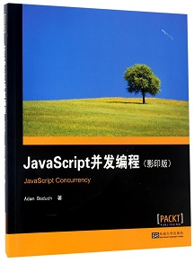

## 《JavaScript并发编程》翻译中文版

原书pdf电子书：[https://pan.baidu.com/s/1D58-nAhSqPsJVHTyb1357w](https://pan.baidu.com/s/1D58-nAhSqPsJVHTyb1357w)

由于能力有限，肯定存在翻译不清楚甚至翻译错误的地方，欢迎朋友提issue指出，感谢。

- [I.目录](I.目录.md)

- [II.前言](II.前言.md)

- [第一章 JavaScript并发简介](01.第一章%20JavaScript并发简介/README.md)

- [第二章 JavaScript运行模型](02.第二章%20JavaScript运行模型/README.md)

- [第三章 使用promise实现同步](03.第三章%20使用promise实现同步/README.md)

- [第四章 使用Generators实现惰性计算](04.第四章%20使用Generators实现惰性计算/README.md)

- [第五章 使用Web Workers](05.第五章%20使用Web%20Workers/README.md)

- [第六章 实用的并行化](06.第六章%20实用的并行化/README.md)

- [第七章 抽象并发](07.第七章%20抽象并发/README.md)

- [第八章 NodeJS中的Evented IO](08.第八章%20NodeJS中的Evented%20IO/README.md)

- [第九章 NodeJS高级并发](09.第九章%20NodeJS高级并发/README.md)

- [第十章 构建并发应用程序](10.第十章%20构建并发应用程序/README.md)

- [III.难懂英中文对照表](III.难懂英中文对照表.md)